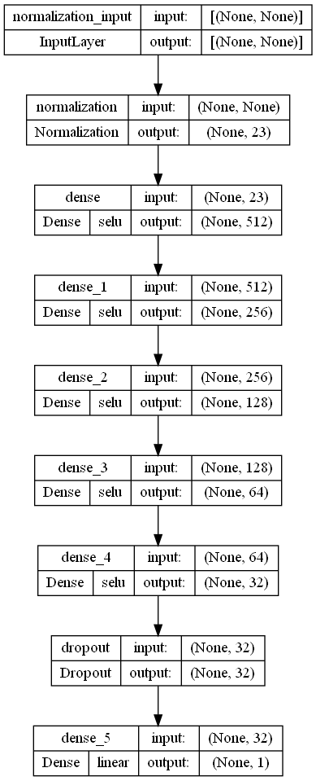
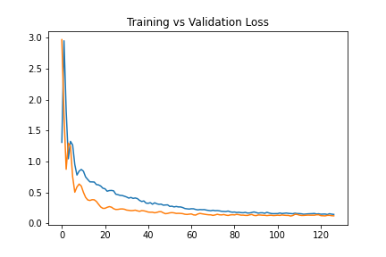
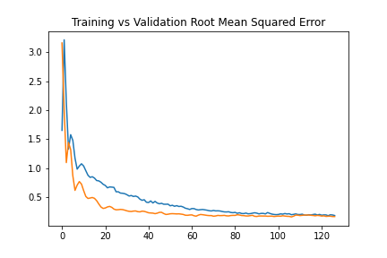
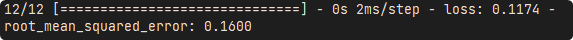

# Project 2 - Productivity Prediction of Garment Employees
Simple heart disease classifier built on Keras

## Table of contents
* [General info](#general-info-general-info)
* [Framework](#framework-framework)
* [Methodology](#methodology-methodology)
* [Results](#results-results)

## General info
This project is done to fulfil the requirement for class AI07. The aim of the project is to create a predictor to predict productivity of garment employees using data from [UCI](https://archive.ics.uci.edu/ml/datasets/Productivity+Prediction+of+Garment+Employees).

## Framework
This project is created using Spyder as the main IDE. The main frameworks used in this project are Pandas, Scikit-learn and TensorFlow Keras.

## Methodology
### Data
Data is imported from Kaggle in form of csv. Pre-processing is done to correct spelling and and fill empty cells. OneHot encoding is also applied to represent the string data. Data is then split into training-test dataset with ratio of 7:3.

### Model
Model is constructed with feedforward neural network. The structure of the model is as follows.

Model is then trained with training dataset with the whole dataset as batch size in 300 epochs with early stopping applied. Training stops at epoch 138 and obtain mean absolute error of 0.1437 and root mean squared error of 0.1838

## Results
Model is evaluated using test dataset and the following are the results.

