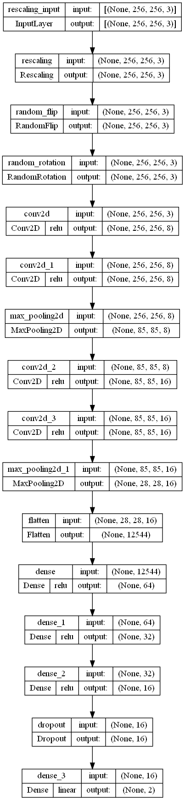
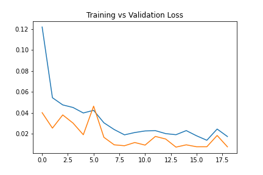
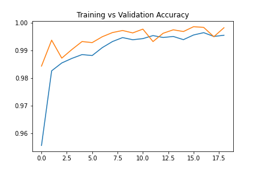
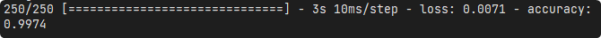

# Project 3 - Concrete Crack Image Classification
Concrete crack image classification using deep neural network.

## Table of contents
* [General info](#general-info-general-info)
* [Framework](#framework-framework)
* [Methodology](#methodology-methodology)
* [Results](#results-results)

## General info
This project is done to fulfil the requirement for class AI07. The aim of the project is to create a classifier to classify whether an image of concrete slabs have cracks or not using data from [Mendeley Data](https://data.mendeley.com/datasets/5y9wdsg2zt/2).

## Framework
This project is created using Spyder as the main IDE. The main frameworks used in this project are Pandas, Scikit-learn and TensorFlow Keras.

## Methodology
### Data
Images imported from Mendeley is already separated into positive and negative folder. Image is then imported then resized into 100x100 images. Images is then split into training-test dataset with ratio of 4:1.

### Model
Model is constructed with deep neural network. Image is rescaled and then data augmentation is applied to increase accuracy. The structure of the model is as follows.

Model is then trained with training dataset with batch size of 32 in 20 epochs with early stopping applied. Training stops at epoch 19 and obtain loss of 0.0172 and accuracy of 99.5%.

## Results
Model is evaluated using test dataset and the following are the results.

