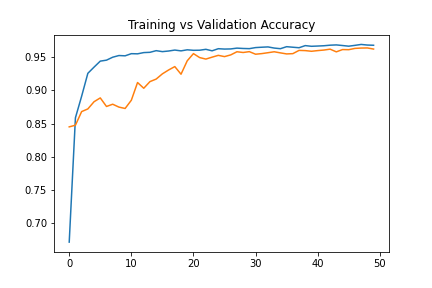

# Project 4 - Semantic Segmentation for Cell Nuclei
Cell nuclei semantic segmentation using deep neural network.

## Table of contents
* [General info](#general-info-general-info)
* [Framework](#framework-framework)
* [Methodology](#methodology-methodology)
* [Results](#results-results)

## General info
This project is done to fulfil the requirement for class AI07. The aim of the project is to create a segmentation model for nuclei images based on dataset from [Kaggle](https://www.kaggle.com/competitions/data-science-bowl-2018/overview).

## Framework
This project is created using Spyder as the main IDE. The main frameworks used in this project are Pandas, OpenCV2, scikit-learn and TensorFlow Keras.

## Methodology
### Data
Images imported from Kaggle is already separated into train and test dataset with each dataset contains images of nuclei and its masks. Images and masks are then imported then resized into 128x128.

### Model
Model is constructed using a modified U-Net and to reduce the number of trainable parameter, we use pretrained model MobileNetV2 as the encoder. Data augmentation and sample weight is applied to increase accuracy. The structure of the model is as follows.

Model is then trained with training dataset with batch size of 1/10th the size of the train dataset in 50 epochs. The training results in loss of 0.0312 and accuracy of 96.8%.

## Results
Figure shown below are the images of the nuclei, the true mask and the predicted masks.

